 

  

 

## 📊 GitHub Stats

 

 

## 🛠️ Tech Stack

 

## 🏆 GitHub Trophies

 

## 📈 Contribution Activity

 

## 🐍 Snake eating my contributions

<picture>
  <source media="(prefers-color-scheme: dark)" srcset="https://raw.githubusercontent.com/seph1709/seph1709/output/github-contribution-grid-snake-dark.svg">
  <source media="(prefers-color-scheme: light)" srcset="https://raw.githubusercontent.com/seph1709/seph1709/output/github-contribution-grid-snake.svg">
  
</picture>

 

## 🌐 Let's Connect

 

